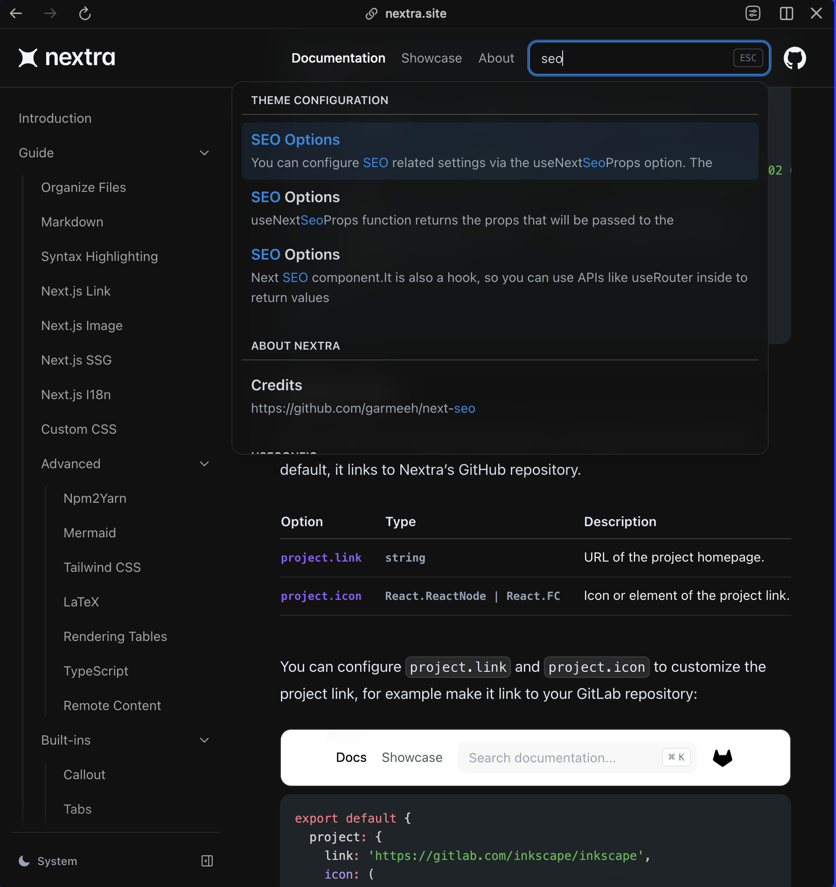

# Docs Coof-Off : Nextra Edition


# 👨‍🍳👨‍🍳 Docs Cook-Off: Nextra Edition

_Huge thank-you to Luke and Priyank for all their assistance, feedback and wisdom in helping me with this._ 

​Welcome to Docs Cook-Off! Where we sizzle sidebars, marinate markdown and juilenne javascript to help you find the perfect platform for your documentation needs.

This is the **Nextra** branch, featuring Nextra, the documentation platform built on Next.js. It's the documentation engine behind the docs for [GraphQL](https://graphql.org/), [CodeSandbox](https://codesandbox.io/docs/learn), [Auth.js](https://authjs.dev/), [Irys](https://docs.irys.xyz/), [Avail](https://docs.availproject.org/) and more. 

_You can see us build the first few commits on this repo in [this livestream here.](https://x.com/spaceagente/status/1833854487557226744)_

## Running This Repo

_Prequisites: npm 10.8.2, node 20.17.0_

You can run this repo locally by running:

```bash
npm i
```

```bash
npm run dev
```

And opening the localhost (typically http://localhost:3000)

# Nextra Overview

**TLDR: Nextra is a good off-the-shelf solution for you if:**

**a) Your team is comfortable with Javascript / Typescript development (no GUI for non-command-line folks)**

**b) Your team is already using / most familiar with Next.js (definitely has some gotchas)**

**c) Open-source and / or free is important to you.** 


| **Pros**                                                                                      | **Cons**                                                                                                                                                                                                       |
|-----------------------------------------------------------------------------------------------|----------------------------------------------------------------------------------------------------------------------------------------------------------------------------------------------------------------|
| Inherit the benefits of Next.js                                                               | Development may be delayed, leading to some footguns (e.g., Nextra currently requires a previous version of Next.js)                                                                                                            |
| Open-Source / Free                                                                            | Documentation missing some elements                                                                                                                                                                            |
| Easy enough to get to a Markdown-based directory (for folks like me who are afraid of props and Javascript frameworks) | Long-term viability of the open-source projects. If, for some reason, contributors move on to other projects, Nextra may fall behind and you may have to switch in the future. (This is more of a long-term concern.) |

_Please note: Most of the cons are related to Nextra’s open-source license, which is also its main pro. It’s a double-edge sword._ 

Diving more into the details:

## Theme Customization

* Dark / Light Mode available out of the box
* Basic theme customization for Nextra (color / logo / etc) 
is straightforward and can be done through the `theme.config.jsx` file (docs [here](https://nextra.site/docs/docs-theme/theme-configuration)).

Deeper CSS support is available in two main ways:

**1. Traditional custom CSS through a `globals.css`** [More info here](https://nextra.site/docs/guide/custom-css).
**2. Tailwind — Nextra provides documentation for adding Tailwind CSS to your project. It requires familiarity with Tailwind as well as passing in the CSS file to _app.js (more on that below). [Documentation on using Tailwind with Nextra here.](https://nextra.site/docs/guide/advanced/tailwind-css)**

Note: For both the CSS and Tailwind to take, you need to pass whatever 
global CSS file you’re using through `pages/_app.jsx`:

```js
import '../path/to/your/globals.css'
 
export default function App({ Component, pageProps }) {
  return <Component {...pageProps} />
}
```

## Code Support

Nextra's code support is nice, providing the following options for code blocks embedded in MDX:

(These are all demoed in the [Quickstart](./pages/docs/quickstart.mdx) section of this repo)

* **Copy Code:** Can enable globally "Copy Code" for all code blocks. Done in [`next.config.js`](./next.config.js), “defaultShowCopyCode: ‘true’”. From Nextra Docs: “Once it's enabled globally, you can disable it via the copy=false attribute.” [More here.](https://nextra.site/docs/guide/syntax-highlighting#copy-button)

* **Show Filename in the Code Block** In the ticks for the codeblock, include `filename=”name”` 

* **`showLineNumbers`** Shows line numbers in the code block. For some reason, can’t do globally, but, again, put in the codeblock ticks.

### Multi-Tab Code Block Support

[Priyank](http://twitter.com/PriyankGupta03) from Avail provided this section on how to do multi-tab code block support. Again, you can view it in the [Quickstart](./pages/docs/quickstart.mdx) section of this repo.

1. Import the Tabs component at the top of the MDX file:

```js
import {Tabs} from 'nextra/components'
```

2. Using it within the page looks like this:

```md
<Tabs items={['avail-js', 'avail-deno', 'avail-rust']}>

<Tabs.Tab>
Content for the first block
</Tabs.Tab>

<Tabs.Tab>
Content for the second block
</Tabs.Tab>

<Tabs.Tab>
Content for the third block
</Tabs.Tab>

</Tabs>
```

Custom code snippets (with the above features supported) are embedded within `<Tabs></Tabs>`. See an example [here.](./pages/docs/quickstart.mdx#initialization)

### LaTeX Rendering

Nextra supports direct LaTex rendering in MDX using KaTeX, you can read more about it [here.](https://nextra.site/docs/guide/advanced/latex)

## API Documentation Support

[Luke from Irys](https://x.com/spaceagente) says:

> "Nextra doesn’t have native support for it, 
but I managed to add it using [OpenAPI](https://github.com/OpenAPITools/openapi-generator) 
and [Swagger UI for React](https://www.npmjs.com/package/swagger-ui-react). 
We then [hacked the CSS](../components/RestApiDemo/swagger-custom.module.css) to change colors."

All the API page coding is from Irys Docs (hooray open-source!). We've put it [here](./components/RestApiDemo/) in the repo. You can see it in action [here](./pages/docs/api.mdx) and when you run the repo.

You can see the public version [here](https://docs.irys.xyz/build/d/rest-api/general) 
and the repo [here.](https://github.com/Irys-xyz/Irys-docs-v2/tree/main/pages/build/d/rest-api). 

Thank you, Luke and Irys team!

## Search Support

Nextra has a default search option that comes default with the Docs theme. It uses [FlexSearch](https://github.com/nextapps-de/flexsearch) to index and deliver the content. 

It seems totally decent for out of the box but is not particularly subtle. For example, searching for “SEO” on the Nextra Docs page (built with Nextra), there are three results, but it’s all the same entry:



Again, totally decent for off-the-shelf but something to be aware of.

You can also custom style some elements of search through properties in `theme.config.js`. This includes styling errors, empty results, and placeholder text. Read more here.

## SEO

Nextra leverages Next.js SEO options, such as same suffix for site titles, configuring `<head>` tags with meta, title, favicon, etc; and dynamic tags based on page. [More information here.](https://nextra.site/docs/docs-theme/theme-configuration#search)

## Grab Bag 

### Internationalization 
Nextra supports multi-language docs through Next.js Internationalized Routing out of the box. More information [here.](https://nextra.site/docs/guide/i18n)


Please leave a PR with anything I missed!

Thank you again for Luke and Priyank for all your assistance, feedback and wisdom!
