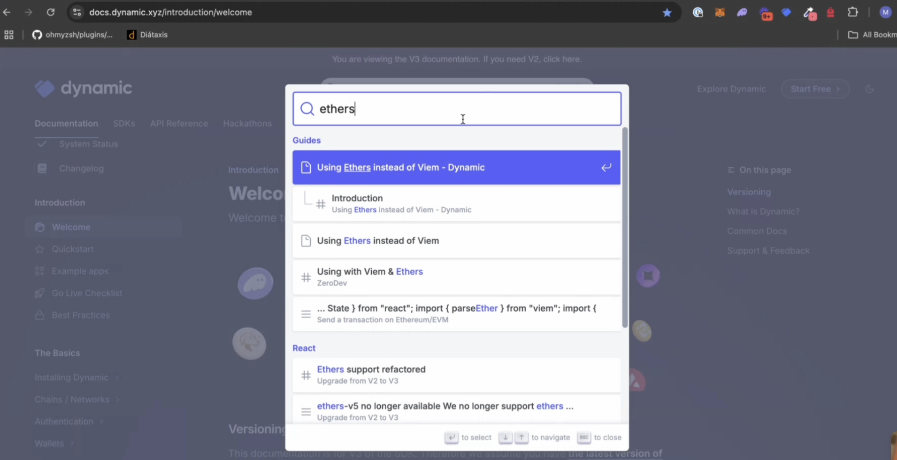

# 👨‍🍳👨‍🍳 Docs Cook-Off :: Mintlify Edition

For each Docs Cook-off, we select a popular documentation platform or service. Then, we bring in a world-class team to help us cook up a few challenges with that platform. For each challenge, we use the same lorem ipsum text and documentation filler.

All projects cannot be everything to everyone and have to make trade-offs. 
Over the course of the cook-off, we hope to identify the biggest differentiators and trade-offs major platforms have made. We highligh the pros and cons of each platform so you can make the best call for your team’s goals and technical capacities.

In our repo, you can find branches with Nextra and Docusaurus. You can also follow along as we work on today’s platform: Mintlify.

According to their website, Mintlify is an AI-powered documentation tool 
that helps developers generate and maintain documentation from their code. 
It’s a paid service and closed-source (the first of these we’ve done). 
It’s used by companies such as [Anthropic](https://mintlify.com/customers/anthropic) (Claude) and Cursor AI

* Nextra
* Mintlify (🔜)
* Docusaurus (🔜)

--
slightly less customizability, but easy to use. gives you everything out of the box,
for that you're on your own.

far behind Docusaurus

# Install and Usage

Install by following steps on website: clone template and start building from there

A few ways to interact with Mintlify:

1) Mintlify.com's UI is great for folks who aren't the most tech savvy, but it's still using a code editor-like experience: dashboard.mintlify.com/dynamic/dynamic-docs

2) Mintlify's CLI command line tool, installation instructions here. provides native tools for things like checking for broken links and redirects as well. * redirects allow for native redirections

# customization:

* all the work happens in mint.json

## Sidebar & Navbar

* Navbar: "topbarLinks" + "topbarCtaButton" + "tabs"

* sidebar: 

"Anchors": Top links on the sidebar

"Navigation" :: Declarative sidebar structure:

```
"navigation": [
  {
    "group": "Introduction", 
    "icon": "hand-wave",
    "pages": [ 
      "introduction/welcome"
      "quickstart", 
      "example-apps"
      "go-live-checklist", 
      "developer-best-practices"
      ]
  },
  {
    "group": "The Basics", 
    "pages": [
      {
        "group": "Installing Dynamic"
        "pages": [ 
          "adding-dynamic/adding-the-sdk", 
          "adding-dynamic/dynamic-context-provider"', 
          "adding-dynamic/using-wagmi", 
          "adding-dynamic/using-ethers"
        ]
      },
      { 
        "group": "Chains / Networks",
        "pages": [
          "chains/enabling-chains", 
          "chains/embedded-wallets-chains",
          "chains/smart-wallet-chains"
        ]
      },
  },
...
]
```

## Theme customization

* custom CSS :: part of a paid tier

* custom JS :: part of the bar on top

A potential painpoint for developers :: a paid feature which allows you more pain.

custom JS also requires fairly brittle targeting of class names, which aren't consistent or
particularly readable. Here's a sample piece of JS targeting a certain element on the Mintlify
page:

```js
const background = • document.querySelector('.hidden.lg\\:block.mx-px.relative.flex-1.bg-white.dark\\:bg-gray-900.pointer-events-auto.rounded-1g')
.if(background) {
  background.style.backgroundColor = 'transparent'; 
  background.style.opacity = '1'
}
```

# Code support

Mintlify has indexed for strong UI support for code components and styling, so these are
more powerful out of the box:

* components: UI for design is good, see tabs and accordion dropdown

Accordion: mintlify.com/docs/content/components/accordion-groups#accordion-groups

Code Groups: https://mintlify.com/docs/content/components/code-groups


* Custom JS allows for extending capacity in the similar way you would use swizzling
on Docusaurus.

* iFrame development is not the most intuitive process, but it's a clean, sandboxed environment
that if your team is comfortable with, it's a potentially stronger choice than
needing to go with swizzling patterns.

# API Reference

Takes OpenAPI and auto-generates API docs with commands in multiple languages
very beautiful API page.

Autogeneration here:

mintlify.com/docs/api-playground/openapi/setup#autogenerate-files

Custom API work here:


# Search and SEO / Analytics

28m in recording
Search: Native with Algolia and Inkeep out of the box

You can roll your own Algolia and overwrite it with customJS:

TODO: Ping Matthew if it's okay to use custom JS searchbar stuff?

```js
Promise.all([
  loadScript("https://cdn.jsdelivr.net/npm/@docsearch/js@3"), 
  loadScript("https://cdn.jsdelivr.net/npm/@docsearch/css@3")
  ]).then(() => { 
    function initializeDocsearch() { 
      const button = document.querySelector('#search-bar-entry'); 
      const mobileButton = document. querySelector('#search-bar-entry-mobile'); 
      
      if (!button || !mobileButton) { 
        console.log('Elements not ready, retrying after a short delay'); 
        setTimeout (initializeDocsearch, 100); 
        return; 
      } 
      
      console.log('Elements ready, initializing Docsearch'); 
      
      button.outerHTML = '<div id="docsearch">«/div>'; 
      mobileButton.outerHTML = '<div id="docsearch-mobile"></div>'; 
      
      const div = document.getElementById('docsearch'); 
      const mobileDiv = document.getElementById('docsearch-mobile'); 
      
      if (div) { 
        div.style.display = 'flex'; 
        div.style.justifyContent = 'center';
        div.style.alignItems = 'center';
        div.style.width = '100%';
      }

      function styleDocSearchButtons () { 
        const buttons = document.getElementsByClassName('DocSearch-Button'); 
        if (buttons. length === 0) { 
          setTimeout (styleDocSearchButtons, 100); 
          return;
        }
      }
```

Custom algolia instance with routing, leading to nice structure results such as the
following which divide up the subjects into "Guides" and "React," for example:




Takeaways:


Posthog great 


Overall: With limited resources, Mintlify provides a powerful tool out of the box
that looks great and does all the amazing indexing. Team ships fast, very responsive,
takes care of a lot of stuff and provides 