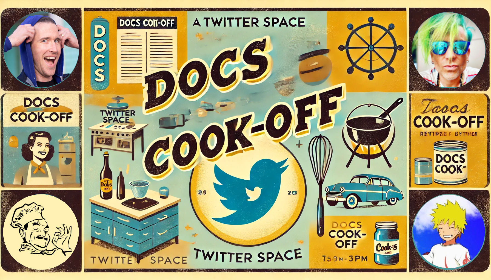

# 👨‍🍳👨‍🍳 Docs Cook-Off Main Repo

​Welcome to Docs Cook-Off! Where we sizzle sidebars, marinate markdown and juilenne javascript to help you find the perfect platform for your documentation needs.

​For each Docs Cook-off, we select a popular documentation platform or service. Then, we bring in a world-class team to help us cook up a few challenges with that platform. For each challenge, we use the same lorem ipsum text and documentation filler.

​In this session, Luke from Irys (https://x.com/spaceagente) and Priyank from Avail (twitter.com/PriyankGupta03) slice and dice with Nextra, the documentation platform based on Next.js.

Clone this repo to follow along!

[Luma invite](https://lu.ma/95bfczuz)