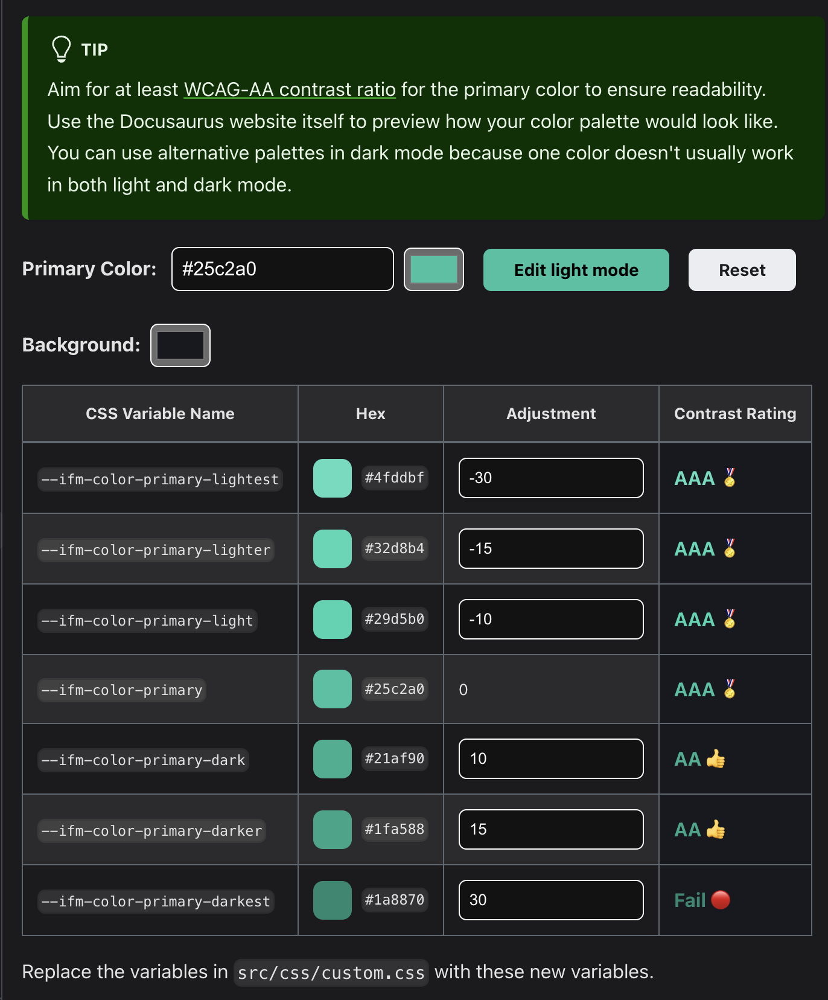

# 👨‍🍳👨‍🍳 Docs Cook-Off :: Docusaurus Edition

​Welcome to Docs Cook-Off! Where we sizzle sidebars, marinate markdown and juilenne javascript to help you find the perfect platform for your documentation needs.

This is the Docusaurus branch, featuring Docusaurus (duh), the Meta-supported React-based documentation platform. The following projects' documentation runs on Docusaurus:

[React](https://react.dev/) (& [Native](https://reactnative.dev/)) — [Redux](https://redux.js.org/) — [Ethereum.org](https://ethereum.org/en/) — [Node.js](https://nodejs.dev/) — [Apollo Graph QL](apollographql.com/docs) — and many more.

Huge thanks to [Chef Youssef](https://x.com/youssefea_) from Superfluid, who cooked with us. (Some sites he's built with Docusaurus: [Superfluid](https://docs.superfluid.finance/) — [Superboring](https://docs.superboring.xyz/docs/intro) — [Alfafrens](https://docs.alfafrens.com/))

# TLDR

Pros: Docusaurus plug-ins offer a lot of nice extensibility quickly and cheaply.

Docusaurus also seems to have anticipated a lot of issues projects may experience (versioning, multi-instance) and provides flashy things out-of-the-box (interactive code editor with rendered output)

It’s also a bit more fine-grained. Nextra, for example, has a config file where you can do a lot of the editing. Docusaurus does have its docusaurus.config.js file, but that seems to be mainly pointing out to plug-ins or custom built components.

Cons: This can perhaps be chalked up to Docusaurus being “closer to the [React] metal” since it’s not using a React framework. Because of this, it allows a lot of customization that will be natural to a React developer. However, the overall effect (in my biased opinion) is that it’s more complicated for non-React developers to maintain.

This is a more subtle concern: The default template is so powerful, your documentation will meet all the needs of your users but lack the "wow" factor that non-developer audiences (Business Development or Leadership, eg) are typically using to judge the success of a documentation initiative.

All projects cannot be everything to everyone and have to make trade-offs. Overall, Docusaurus has sacrificed some slick interfaces and ease-of-use for powerful and composable technical features.


**1) Meta's support** seems to have been a huge push which provided good material support (docs are up-to-date, well-polished) *and* has created a strong community (OpenAPI, for example, built and supports its own plug-in for Docusaurus)

**2) Docusaurus feels a bit more fine-grained than Nextra:** the docusaurus.config.js file felt a bit more complicated than the nextra.config.js file — perhaps because Next is a framework, Nextra can use a bit more abstraction? The overall effect is more extensability and capacity with Docusaurus but also could be a bit more challenging for a non-React dev who's not a strong frontend developer to build out / maintain beyond the template (which is very robust on its own).

**3) Docusaurus seems like it's anticipated developers' need a bit more than Nextra:** Copy code and line-wrapping is default in the codeblocks, for example, and you can also get a totally decent interactive code editor (built on React Live) in a few lines of code


## Setup

[Docusaurus docs](https://docusaurus.io/docs/installation) recommend running Node.js version 18 or higher.

Docusaurus has a [great quickstart guide.](https://docusaurus.io/docs/installation) Their template is comprehensive for basic needs with minimal changes.

Clone this repo, `cd` into the directory, `cd` into the directory `website` and then run the following command to start the development server:

```bash
npm run start
```

We're deleting the blog directory to focus on the documentation template.

## Customization (Layout, Theme, etc.)

### Sidebar 
Docusaurus can [automatically generate a sidebar](https://docusaurus.io/docs/sidebar) or you can explicitly generate one.

Youssef prefers automatic sidebar generation. A few reasons to not have that: if you’d like to have the landing page customized; if you’d like to change ordering; perhaps you want a markdown file to appear in multiple sections, etc.

You can see a custom sidebar file from Docusaurus [here](https://github.com/facebook/docusaurus/blob/main/website/sidebars.ts).

### Topbar

Adding elements to the top bar is done in Navbar” in docusaurus.config.ts/.js:

```json
themeConfig: {
…
Navbar: {
title:
logo: { … }
items: [
{
  to: '/tutorials', 
  label: 'Docs', 
  position: 'left'
          },
{
  to: '/learn', 
  label: 'Learn', 
  position: 'left'
          },
]
}

}
```

### Theme Customization

Docusaurus provides an easy way to import / adapt your project's brand into the project ([follow along here](https://docusaurus.io/docs/styling-layout)). It uses [Infima](https://infima.dev/) as the styling framework and if you go to the ["Styling with Infima" section of their docs,](https://infima.dev/) you can use their colorbox to provide custom styling that are accessible for all users.



